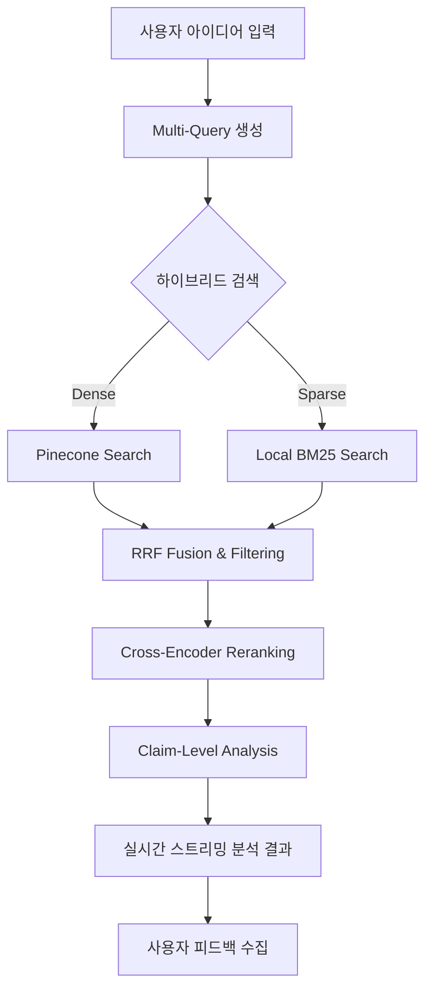

# ⚡ 쇼특허 (Short-Cut)

**AI 기반 특허 선행 기술 조사 시스템**

사용자의 아이디어를 입력하면 기존 특허와 비교하여 **유사도**, **침해 리스크**, **회피 전략**을 분석해주는 RAG 기반 특허 분석 도구입니다.

> **Team 뀨💕** | [기술 제안서](report/v3_technical_proposal.md) | [기술 리포트](report/v3_technical_report.md)

---

## 🎯 주요 기능

| 기능 | 설명 |
|------|------|
| **Multi-Query RAG** | 기술적/법적 관점으로 쿼리를 자동 확장하여 검색 누락 최소화 |
| **Hybrid Search** | Pinecone (Dense) + Local BM25 (Sparse) + RRF 융합 검색으로 정확도 극대화 |
| **Reranker** | Cross-Encoder 모델을 활용하여 검색 결과의 관련성 정밀 재정렬 |
| **Claim-Level Analysis** | '모든 구성요소 법칙(All Elements Rule)'을 적용한 특허 침해 리스크 정밀 진단 |
| **IPC Filtering** | 일반 사용자도 이해하기 쉬운 기술 태그(라벨) 기반 필터링 제공 |
| **Feedback Loop** | 분석 결과에 대한 사용자 피드백(👍/👎) 수집 및 검색 품질 개선 엔진 |
| **Streaming Output** | 분석 과정을 실시간으로 출력하여 사용자 대기 시간 체감 0초 달성 |
| **Visualization** | 특허 간 관계를 타임라인 및 토픽 맵으로 시각화하여 직관적 파악 가능 |

---

## 🚀 빠른 시작

### 1. 환경 설정

```bash
# 가상환경 생성 및 활성화
conda create -n shortcut python=3.11 -y
conda activate shortcut

# 의존성 설치
pip install -r requirements.txt

# NLP 모델 다운로드
python -m spacy download en_core_web_sm
```

### 2. 환경 변수 설정

`.env` 파일을 프로젝트 루트에 생성하고 아래 항목을 입력합니다:
```env
OPENAI_API_KEY=your-openai-api-key
PINECONE_API_KEY=your-pinecone-api-key
GCP_PROJECT_ID=your-gcp-project-id  # BigQuery 연동 시 필요
```

### 3. 데이터 인덱싱 (최초 1회)

```bash
# 데이터 전처리 및 Pinecone/BM25 인덱스 생성
python src/pipeline.py --stage 5
```

### 4. 웹 앱 실행

```bash
streamlit run app.py
```

---

## 📊 분석 아키텍처



---

## 📁 프로젝트 구조

```
SKN22-3rd-2Team/
├── app.py                   # Streamlit 메인 애플리케이션
├── src/
│   ├── analysis_logic.py    # 분석 프로세스 오케스트레이션
│   ├── patent_agent.py      # AI 에이전트 핵심 로직 (RAG, Claim Analysis)
│   ├── vector_db.py         # 하이브리드 검색 엔진 (Pinecone + BM25)
│   ├── reranker.py          # 정밀 재정렬 모델
│   ├── feedback_logger.py   # 사용자 피드백 로그 저장
│   ├── history_manager.py   # 분석 이력 관리 (SQLite)
│   ├── ui/                  # UI 컴포넌트 및 스타일
│   └── preprocessor.py      # 특허 문서 파서 및 전처리기
├── logs/                    # 시스템 및 피드백 로그
├── tests/                   # 품질 검증 테스트 (DeepEval)
└── report/                  # 기술 문서 및 분석 보고서
```

---

## 🔧 주요 설정 (src/config.py)

| 설정 항목 | 설명 |
|------|------|
| `PINECONE_INDEX_NAME` | Pinecone 서버리스 인덱스 이름 |
| `ANALYSIS_MODEL` | 분석에 사용하는 LLM 모델 (Default: gpt-4o) |
| `TOP_K_RESULTS` | 최종 분석에 반영할 특허 개수 |
| `HYBRID_ALPHA` | Dense/Sparse 검색 가중치 비율 |

---

## 📄 라이선스

MIT License

---

## 👥 Team 뀨💕
**쇼특허 (Short-Cut)** - "특허 분석의 지름길을 제시합니다."
