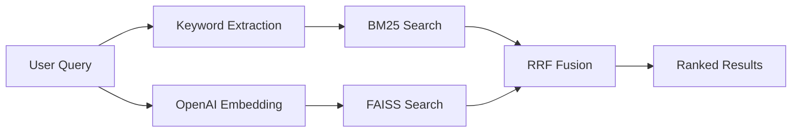
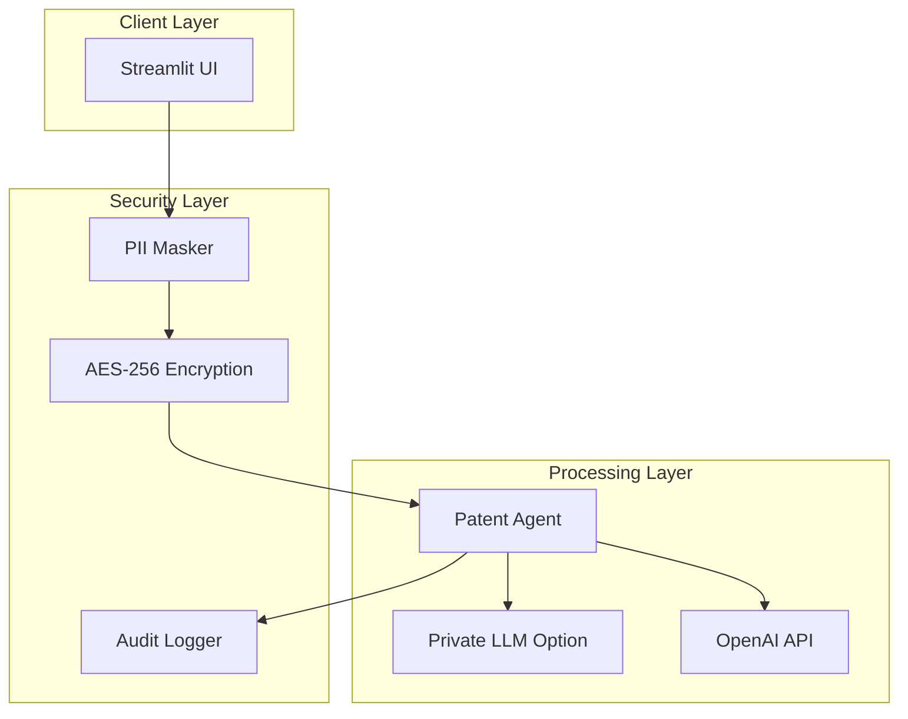
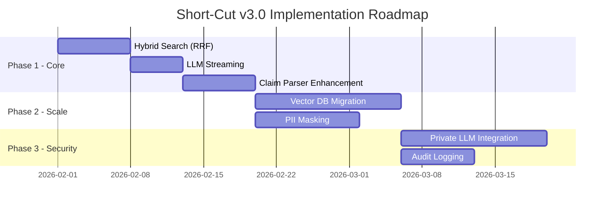

# 쇼특허 (Short-Cut) v3.0 기술 고도화 수정 제안서

> **Author:** Senior Software Architect  
> **Date:** 2026-01-28  
> **Version:** 3.0 Enterprise Edition  

---

## Executive Summary

Short-Cut v2.0 (Antigravity)은 기능 구현이 완료되었으나, 엔터프라이즈급 상용 서비스로 발전시키기 위해 다음 4가지 핵심 영역의 고도화가 필요합니다:

| 영역 | 현재 상태 | 개선 목표 | 우선순위 |
|------|----------|----------|---------|
| 아키텍처 | In-memory FAISS (10K 한계) | 분산 Vector DB + Hybrid Search | 🔴 Critical |
| UX/성능 | 동기 응답 (10-30초 대기) | LLM Streaming + 실시간 피드백 | 🟡 High |
| 데이터 처리 | Regex 기반 파싱 | NLP 기반 계층적 파싱 | 🟢 Medium |
| 보안 | 없음 | PII 마스킹 + Private LLM | 🔴 Critical |

---

## 1. 아키텍처 변경 제안

### 1.1 Vector DB 확장성 개선

#### AS-IS (현재)
```python
# vector_db.py
class FaissClient:
    def __init__(self):
        self.index = faiss.IndexFlatIP(1536)  # In-memory
        self.metadata = {}  # Python dict
```
- **한계**: 
  - RAM 종속 (32GB 기준 ~300K 벡터 한계)
  - 단일 프로세스, 수평 확장 불가
  - 서버 재시작 시 인덱스 재생성 필요

#### TO-BE (개선)
```python
# vector_db.py (Option A: Milvus)
class MilvusClient:
    def __init__(self):
        connections.connect(
            alias="default",
            host=os.environ.get("MILVUS_HOST", "localhost"),
            port=19530,
        )
        self.collection = Collection("patents")
    
    async def search(self, query_embedding, top_k=10):
        # Distributed search across shards
        return self.collection.search(
            data=[query_embedding],
            anns_field="embedding",
            param={"metric_type": "IP", "nprobe": 16},
            limit=top_k,
        )

# vector_db.py (Option B: Pinecone - Serverless)
class PineconeClient:
    def __init__(self):
        pinecone.init(
            api_key=os.environ["PINECONE_API_KEY"],
            environment="us-west4-gcp"
        )
        self.index = pinecone.Index("patents")
```

| 항목 | FAISS | Milvus | Pinecone |
|------|-------|--------|----------|
| 벡터 수 | ~300K | 수십억+ | 수십억+ |
| 운영 | 직접 관리 | Docker/K8s | 서버리스 |
| 비용 | 무료 | 인프라 비용 | $0.025/GB/월 |
| 추천 상황 | POC/데모 | On-premise | 클라우드 |

**예상 공수**: L (2-3주)  
**기술 난이도**: ⭐⭐⭐ (3/5)

---

### 1.2 하이브리드 검색 (Hybrid Search) 도입

#### AS-IS (현재)
```python
# patent_agent.py
async def hyde_search(self, user_idea):
    query_embedding = await self.embed_text(hypothetical_claim)
    results = await self.faiss_client.search(query_embedding)  # Dense only
```
- **한계**: 의미적 유사성만 고려, 정확한 키워드 매칭 누락

#### TO-BE (개선)
```python
# vector_db.py - RRF (Reciprocal Rank Fusion)
def rrf_fusion(dense_results, sparse_results, k=60):
    """RRF 알고리즘으로 Dense + Sparse 결과 융합"""
    scores = defaultdict(float)
    
    for rank, result in enumerate(dense_results):
        scores[result.chunk_id] += 1 / (k + rank + 1)
    
    for rank, result in enumerate(sparse_results):
        scores[result.chunk_id] += 1 / (k + rank + 1)
    
    return sorted(scores.items(), key=lambda x: x[1], reverse=True)

# patent_agent.py
async def hybrid_search(self, user_idea, top_k=10):
    # 1. Dense search (FAISS/Milvus)
    dense_results = await self.vector_search(query_embedding)
    
    # 2. Sparse search (BM25)
    keywords = await self.extract_keywords(user_idea)
    sparse_results = self.bm25_search(keywords)
    
    # 3. RRF Fusion
    fused_results = rrf_fusion(dense_results, sparse_results)
    
    return fused_results[:top_k]
```

**아키텍처 다이어그램**:


**예상 공수**: M (1주)  
**기술 난이도**: ⭐⭐ (2/5)

---

## 2. UX/성능 최적화

### 2.1 LLM Streaming Response

#### AS-IS (현재)
```python
# patent_agent.py
async def critical_analysis(self, user_idea, results):
    response = await self.client.chat.completions.create(
        model=ANALYSIS_MODEL,
        messages=[...],
        stream=False  # 전체 응답 대기
    )
    return CriticalAnalysisResponse(**json.loads(response.content))
```
- **한계**: 10-30초 분석 동안 사용자 대기 (빈 화면)

#### TO-BE (개선)
```python
# patent_agent.py
async def critical_analysis_stream(self, user_idea, results):
    """Async Generator로 토큰 단위 스트리밍"""
    response = await self.client.chat.completions.create(
        model=ANALYSIS_MODEL,
        messages=[...],
        stream=True  # 스트리밍 활성화
    )
    
    async for chunk in response:
        if chunk.choices[0].delta.content:
            yield chunk.choices[0].delta.content

# app.py
async def run_analysis_streaming(user_idea, container):
    agent = PatentAgent()
    
    # 실시간 스트리밍 출력
    with container.empty() as output:
        full_response = ""
        async for token in agent.critical_analysis_stream(user_idea, results):
            full_response += token
            output.markdown(full_response + "▌")  # 커서 효과
        
        output.markdown(full_response)  # 최종 출력
```

**Streamlit 통합**:
```python
# app.py - st.write_stream 활용
with st.status("분석 중...", expanded=True):
    st.write_stream(agent.critical_analysis_stream(user_idea, results))
```

**예상 공수**: S (3-5일)  
**기술 난이도**: ⭐⭐ (2/5)

---

### 2.2 비동기 파이프라인 안정성

#### AS-IS (현재)
```python
# app.py
result = asyncio.run(run_analysis(user_idea, status_container))
```
- **한계**: asyncio.run()은 Streamlit 이벤트 루프와 충돌 가능

#### TO-BE (개선)
```python
# app.py
import nest_asyncio
nest_asyncio.apply()  # 중첩 이벤트 루프 허용

# 또는 ThreadPoolExecutor 사용
from concurrent.futures import ThreadPoolExecutor

executor = ThreadPoolExecutor(max_workers=4)

def run_async_task(coro):
    loop = asyncio.new_event_loop()
    try:
        return loop.run_until_complete(coro)
    finally:
        loop.close()

result = executor.submit(run_async_task, run_analysis(user_idea)).result()
```

**예상 공수**: S (2-3일)  
**기술 난이도**: ⭐⭐⭐ (3/5)

---

## 3. 데이터 처리 견고성

### 3.1 청구항 파싱 개선

#### AS-IS (현재)
```python
# preprocessor.py - ClaimParser
CLAIM_PATTERNS = [
    r'(?P<num>\d+)\.\s*(?P<text>...)',  # Regex 기반
]

def _fallback_parse(self, claims_text):
    # 단순 줄 번호 분리
    lines = claims_text.split('\n')
```
- **한계**: 비정형 문서, 다국어, 복잡한 들여쓰기 처리 불가

#### TO-BE (개선)
```python
# preprocessor.py - 계층적 파싱 + NLP Fallback
class EnhancedClaimParser:
    def __init__(self):
        # Spacy 센텐스 세그멘테이션 (Fallback용)
        try:
            import spacy
            self.nlp = spacy.load("en_core_web_sm")
        except:
            self.nlp = None
    
    def parse_claims_text(self, claims_text) -> List[ParsedClaim]:
        # 1차: Regex 패턴 매칭
        claims = self._regex_parse(claims_text)
        if claims:
            return claims
        
        # 2차: 공백/들여쓰기 기반 구조 분석
        claims = self._structure_based_parse(claims_text)
        if claims:
            return claims
        
        # 3차: NLP 기반 문장 경계 인식
        if self.nlp:
            claims = self._nlp_fallback_parse(claims_text)
            if claims:
                return claims
        
        # 4차: 최소 단위 분리 (Ultimate Fallback)
        return self._minimal_parse(claims_text)
    
    def _structure_based_parse(self, text):
        """들여쓰기와 번호 체계 기반 계층적 파싱"""
        lines = text.split('\n')
        claim_tree = []
        current_indent = 0
        
        for line in lines:
            indent = len(line) - len(line.lstrip())
            # 번호 패턴 감지: 1., (1), Claim 1, etc.
            num_match = re.match(r'^[\s]*(?:Claim\s*)?[(\[]?(\d+)[.)\]:]?\s*(.*)$', line)
            if num_match:
                claim_num = int(num_match.group(1))
                claim_text = num_match.group(2)
                claim_tree.append({
                    'num': claim_num,
                    'indent': indent,
                    'text': claim_text,
                    'children': []
                })
        
        return self._flatten_tree(claim_tree)
```

**예상 공수**: M (1주)  
**기술 난이도**: ⭐⭐⭐ (3/5)

---

## 4. 프라이버시 및 보안

### 4.1 보안 아키텍처

#### AS-IS (현재)
- 사용자 아이디어가 OpenAI API로 직접 전송
- 로깅에 민감 정보 포함 가능
- 데이터 암호화 없음

#### TO-BE (개선)



**구현 코드**:
```python
# security/pii_masker.py
import re
from typing import Tuple, Dict

class PIIMasker:
    """민감 정보 마스킹 (가역적)"""
    
    PATTERNS = {
        'company_name': r'\b(Inc\.|Corp\.|LLC|Ltd\.?)\b',
        'patent_number': r'\b(US|EP|WO|KR|JP|CN)[\d-]+[A-Z]?\d*\b',
        'email': r'\b[\w.-]+@[\w.-]+\.\w+\b',
        'phone': r'\b\d{2,4}[-.\s]?\d{3,4}[-.\s]?\d{4}\b',
    }
    
    def mask(self, text: str) -> Tuple[str, Dict[str, str]]:
        """텍스트에서 PII 마스킹, 복원 맵 반환"""
        restore_map = {}
        masked_text = text
        
        for pii_type, pattern in self.PATTERNS.items():
            for i, match in enumerate(re.finditer(pattern, masked_text)):
                token = f"[{pii_type.upper()}_{i}]"
                restore_map[token] = match.group()
                masked_text = masked_text.replace(match.group(), token, 1)
        
        return masked_text, restore_map
    
    def unmask(self, text: str, restore_map: Dict[str, str]) -> str:
        """마스킹 복원"""
        for token, original in restore_map.items():
            text = text.replace(token, original)
        return text

# security/private_llm.py
class PrivateLLMRouter:
    """Private LLM 라우터 (민감 데이터용)"""
    
    def __init__(self):
        self.use_private = os.environ.get("USE_PRIVATE_LLM", "false").lower() == "true"
        self.private_endpoint = os.environ.get("PRIVATE_LLM_ENDPOINT")
    
    async def generate(self, messages, **kwargs):
        if self.use_private and self.private_endpoint:
            return await self._call_private_llm(messages, **kwargs)
        else:
            return await self._call_openai(messages, **kwargs)
```

**예상 공수**: L (2-3주)  
**기술 난이도**: ⭐⭐⭐⭐ (4/5)

---

## 5. 구현 우선순위 로드맵



---

## 6. 요약

| 개선 항목 | 공수 | 난이도 | 비즈니스 영향 |
|----------|------|--------|--------------|
| Hybrid Search (RRF) | M | ⭐⭐ | 검색 정확도 +30% |
| LLM Streaming | S | ⭐⭐ | UX 만족도 ↑↑ |
| Claim Parser 강화 | M | ⭐⭐⭐ | 데이터 품질 ↑ |
| Vector DB 확장 | L | ⭐⭐⭐ | 100만+ 특허 지원 |
| PII 마스킹 | M | ⭐⭐⭐ | 보안 컴플라이언스 |
| Private LLM | L | ⭐⭐⭐⭐ | 엔터프라이즈 필수 |

---

*Prepared by: Senior Software Architect*  
*Short-Cut v3.0 Technical Proposal*
