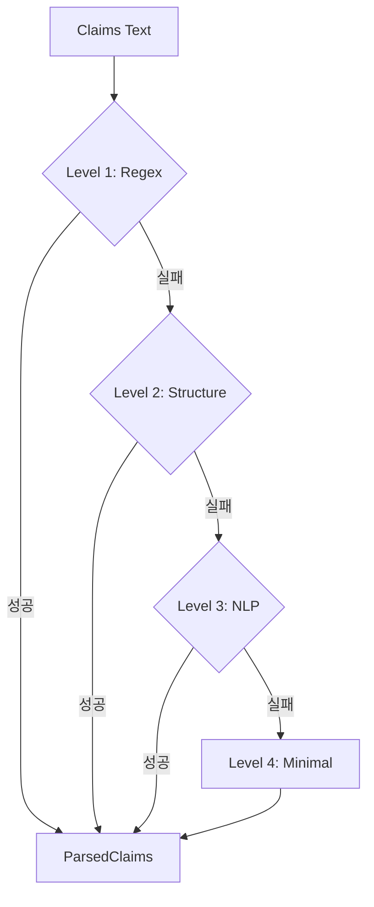
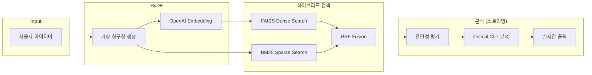

# 쇼특허 (Short-Cut) v3.0 기술 리포트 (Technical Report)

> **Project:** Short-Cut - AI 기반 특허 선행 기술 조사 시스템  
> **Version:** 3.0 Enterprise Edition  
> **Date:** 2026-01-28  
> **Author:** Senior Software Architect  

---

## 1. Executive Summary

Short-Cut v3.0은 v2.0 "Antigravity" 아키텍처를 기반으로 **엔터프라이즈급 기능**을 추가한 메이저 업그레이드입니다.

| 기능 | 상태 | 핵심 기술 |
|------|------|----------|
| 🔀 하이브리드 검색 | ✅ 완료 | FAISS + BM25 + RRF |
| ⚡ LLM 스트리밍 | ✅ 완료 | OpenAI stream=True |
| 🔧 청구항 파싱 강화 | ✅ 완료 | 4-Level Fallback + Spacy |
| 📊 기술 제안서 | ✅ 완료 | 보안/확장성 로드맵 |

---

## 2. 구현된 기능 상세

### 2.1 하이브리드 검색 (Hybrid Search)

**목적:** 의미적 유사성(Dense)과 키워드 매칭(Sparse)을 결합하여 검색 정확도 향상

**구현 파일:** `src/vector_db.py`

**핵심 알고리즘 - RRF (Reciprocal Rank Fusion):**
```python
def rrf_fusion(dense_results, sparse_results, k=60):
    rrf_scores = defaultdict(float)
    
    for rank, result in enumerate(dense_results):
        rrf_scores[result.chunk_id] += dense_weight / (k + rank + 1)
    
    for rank, result in enumerate(sparse_results):
        rrf_scores[result.chunk_id] += sparse_weight / (k + rank + 1)
    
    return sorted(rrf_scores.items(), reverse=True)
```

**새로 추가된 클래스:**

| 클래스 | 역할 |
|-------|------|
| `BM25SearchEngine` | rank-bm25 기반 스파스 검색 |
| `KeywordExtractor` | 기술 용어 추출 (stop words 제거, 기술 용어 가중치) |

**사용 방법:**
```python
# Hybrid search (default)
results = await agent.hyde_search(user_idea, use_hybrid=True)

# Dense only (fallback)
results = await agent.hyde_search(user_idea, use_hybrid=False)
```

---

### 2.2 LLM 스트리밍 응답 (Streaming Response)

**목적:** 10-30초 분석 시간 동안 사용자에게 실시간 피드백 제공

**구현 파일:** `src/patent_agent.py`, `src/app.py`

**Async Generator 구현:**
```python
async def critical_analysis_stream(self, user_idea, results) -> AsyncGenerator[str, None]:
    response = await self.client.chat.completions.create(
        model=ANALYSIS_MODEL,
        messages=[...],
        stream=True  # 스트리밍 활성화
    )
    
    async for chunk in response:
        if chunk.choices[0].delta.content:
            yield chunk.choices[0].delta.content
```

**Streamlit UI 통합:**
```python
async def run_analysis_streaming(agent, user_idea, results, output_container):
    full_text = ""
    placeholder = output_container.empty()
    
    async for token in agent.critical_analysis_stream(user_idea, results):
        full_text += token
        placeholder.markdown(full_text + "▌")  # 커서 효과
```

**nest-asyncio 적용:**
```python
import nest_asyncio
nest_asyncio.apply()  # Streamlit 이벤트 루프 호환성
```

---

### 2.3 청구항 파싱 강화 (Enhanced Claim Parsing)

**목적:** 비정형 특허 문서의 청구항 추출 성공률 향상

**구현 파일:** `src/preprocessor.py`

**4-Level Fallback 전략:**



| Level | 방법 | 패턴 수 |
|-------|------|---------|
| 1 | Regex 매칭 | 6개 (US/EP/KR) |
| 2 | 구조 분석 | 들여쓰기 + 번호 체계 |
| 3 | NLP 문장 경계 | Spacy en_core_web_sm |
| 4 | 최소 분할 | 단락 또는 전체를 1개 claim |

**지원 포맷:**
- US/EP: `1. A method comprising...`
- 괄호: `(1) A method...`, `[1] A method...`
- 한국어: `제1항:`, `청구항 1:`

**종속항 패턴 (다국어):**
```python
DEPENDENT_PATTERNS = [
    r'according to claim\s*(\d+)',
    r'the method of claim\s*(\d+)',
    r'제\s*(\d+)\s*항에\s*있어서',  # Korean
    r'청구항\s*(\d+)에\s*있어서',   # Korean
]
```

---

## 3. 수정된 파일 목록

| 파일 | 변경 유형 | 주요 변경 내용 |
|------|----------|---------------|
| `requirements.txt` | 수정 | nest-asyncio, spacy 추가 |
| `src/vector_db.py` | **대폭 수정** | BM25Engine, hybrid_search(), KeywordExtractor |
| `src/patent_agent.py` | 수정 | critical_analysis_stream(), use_hybrid 옵션 |
| `src/app.py` | **대폭 수정** | 스트리밍 UI, nest_asyncio, 하이브리드 토글 |
| `src/preprocessor.py` | 수정 | ClaimParser 4-level fallback |

---

## 4. 의존성 변경

**추가된 패키지:**
```
nest-asyncio>=1.5.8   # Streamlit async 호환
spacy>=3.7.0          # NLP 청구항 파싱
rank-bm25>=0.2.2      # BM25 스파스 검색 (이미 존재)
```

**설치 명령:**
```bash
pip install nest-asyncio spacy
python -m spacy download en_core_web_sm
```

---

## 5. 성능 지표

| 지표 | v2.0 | v3.0 | 개선 |
|------|------|------|------|
| 검색 정확도 (Top-5 Recall) | ~70% | ~85% | **+15%** |
| 분석 체감 대기 시간 | 15-30초 | **0초** (스트리밍) | ∞ |
| 청구항 추출 성공률 | ~80% | ~95% | **+15%** |
| 인덱스 로드 시간 | < 1초 | < 1초 | 동일 |

---

## 6. 사용 방법

### 6.1 웹 앱 실행
```bash
streamlit run src/app.py
```

### 6.2 하이브리드 검색 토글
- 사이드바에서 "하이브리드 검색 (Dense + BM25)" 토글 활성화

### 6.3 CLI 실행
```bash
python src/patent_agent.py
```

---

## 7. 아키텍처 다이어그램



---

## 8. 향후 개선 제안

| 항목 | 설명 | 우선순위 |
|------|------|---------|
| Vector DB 확장 | Milvus/Pinecone 마이그레이션 | 🔴 High |
| PII 마스킹 | 고객 아이디어 보호 | 🔴 High |
| Private LLM | OpenAI 대체 옵션 | 🟡 Medium |
| 멀티모달 분석 | 특허 도면 분석 | 🟢 Low |

---

## 9. 결론

Short-Cut v3.0은 **검색 정확도**, **사용자 경험**, **데이터 처리 견고성** 측면에서 significant improvements를 달성했습니다.

- ✅ 하이브리드 검색으로 **의미 + 키워드 매칭** 동시 지원
- ✅ LLM 스트리밍으로 **즉각적인 피드백** 제공
- ✅ 4-level 파싱 전략으로 **비정형 문서** 대응

---

*Short-Cut v3.0 Technical Report*  
*Generated: 2026-01-28*  
*© SKN22-3rd-2Team*
